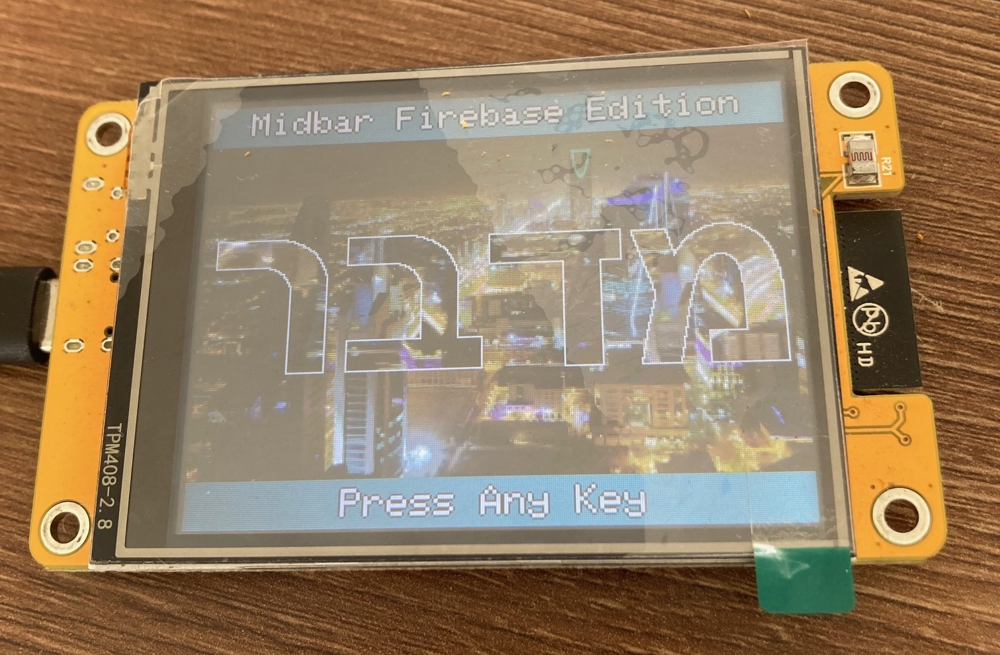

# Midbar-ESP32-CYD2USB-Firebase-Edition
A version of Midbar data vault adapted for the ESP32 CYD2USB and WebFlash. It keeps the cryptographic keys in the ESP32 RAM and stores the ciphertexts (encrypted data) in the Google Firebase.

WebFlash: https://northstrix.github.io/Midbar-ESP32-CYD2USB-Firebase-Edition/flash

Made with the help of [Rovel](https://github.com/Rovel)
